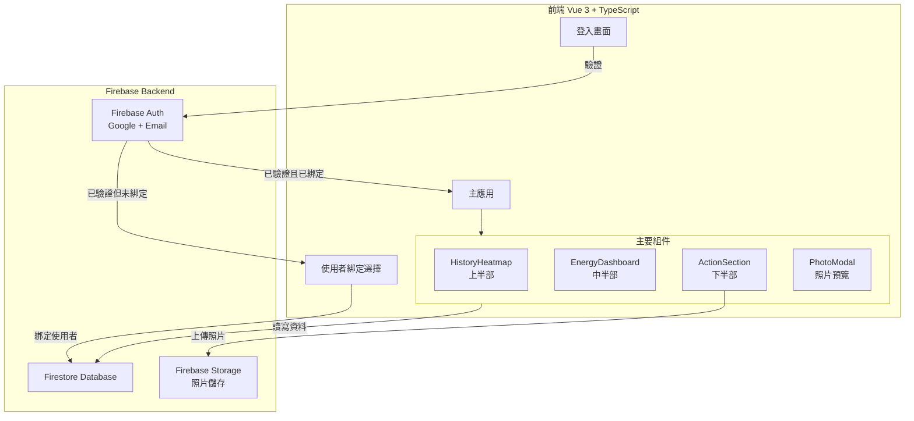
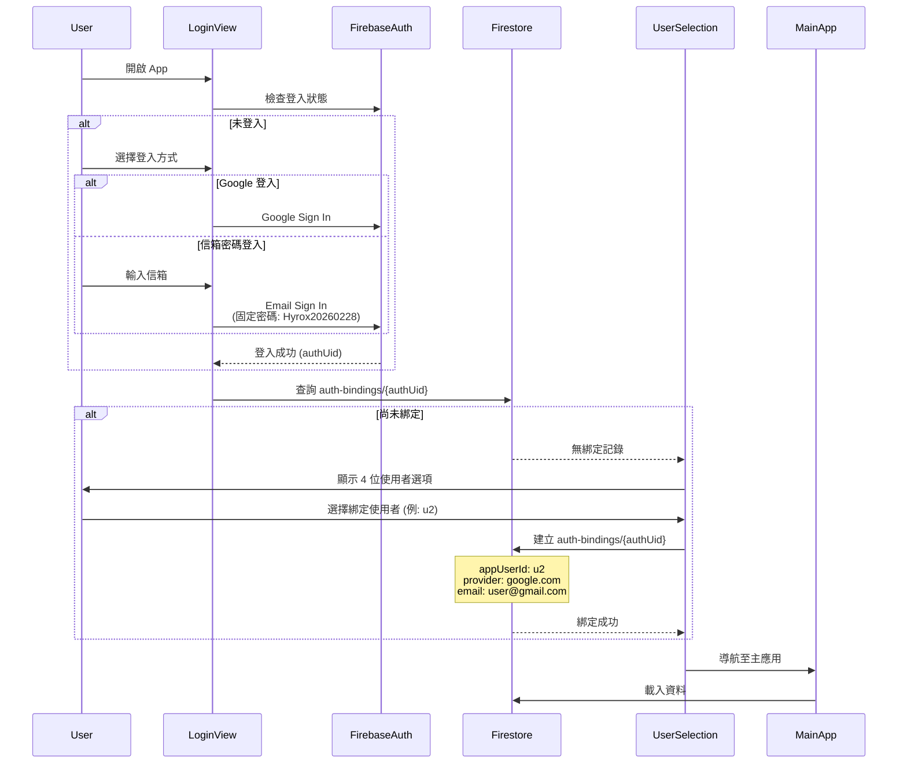
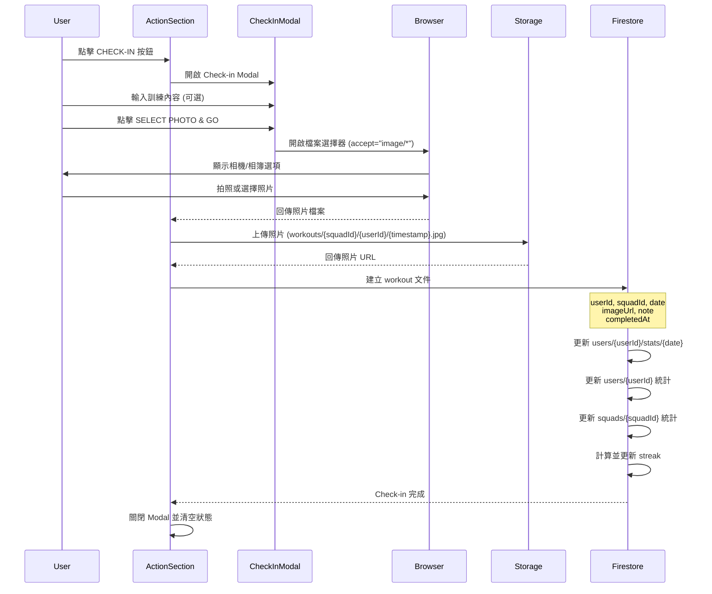
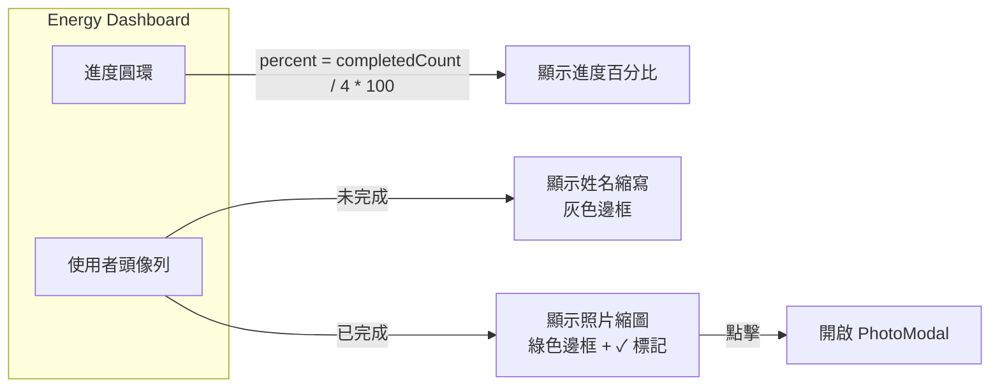
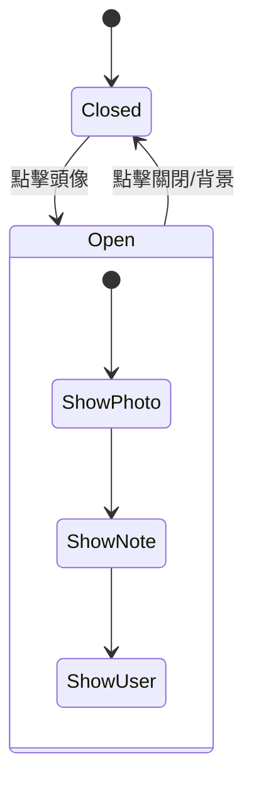
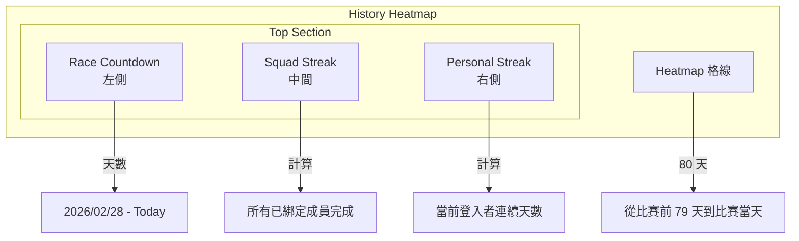

# Hyrox Squad 4 - 規格文件

---

## 目錄

- [專案概述](#專案概述)
- [系統架構](#系統架構)
- [資料模型](#資料模型)
- [功能規格](#功能規格)
- [Personal Streak (個人連續天數)](#personal-streak-個人連續天數)
- [Race Guide (HYROX 比賽指南)](#race-guide-hyrox-比賽指南)
- [技術堆疊](#技術堆疊)
- [安全規則](#安全規則)
- [常數設定](#常數設定)
- [Firestore 嚴格規格與變更管理](#firestore-嚴格規格與變更管理)
- [驗收標準](#驗收標準)
- [關鍵決策記錄](#關鍵決策記錄)
- [未來擴充方向](#未來擴充方向)
- [附錄](#附錄)

---

## 專案概述

**Hyrox Squad 4** 是一個專為 Hyrox 團隊訓練設計的打卡記錄 App，支援 4 人小隊進行訓練追蹤、進度可視化和團隊激勵。

### 核心功能

- ✅ **Check-in 打卡**：上傳訓練照片和內容描述
- ✅ **進度儀表板**：即時顯示團隊完成進度（0-100%）
- ✅ **Heatmap 熱力圖**：80 天訓練歷史可視化
- ✅ **Streak 追蹤**：團隊連續打卡天數計算
- ✅ **使用者綁定**：Firebase Auth 與應用使用者綁定機制
- ✅ **照片預覽**：點擊頭像查看完整訓練照片

### 技術特色

- 使用 Firebase 作為完整後端解決方案（Auth + Firestore + Storage）
- 支援 Google 登入和信箱密碼登入
- 嚴格的 Firestore 安全規則保護資料
- 響應式設計，支援移動端和桌面端
- TypeScript 類型安全，減少執行時錯誤

---

## 系統架構

### 架構圖



### 應用流程

1. **未登入使用者** → 登入畫面（LoginView）
2. **已登入但未綁定** → 使用者選擇畫面（UserSelection）
3. **已登入且已綁定** → 主應用（App）
   - 上半部：Heatmap 和 Streak（HistoryHeatmap）
   - 中半部：進度圓環和頭像（EnergyDashboard）
   - 下半部：Check-in 操作（ActionSection）
   - 彈窗：照片預覽（PhotoModal）

---

## 資料模型

### Firestore Collections 結構

#### 1. `squads/{squadId}`

**用途**：團隊資訊文件

| 欄位                  | 類型      | 必填 | 說明                                  |
| --------------------- | --------- | ---- | ------------------------------------- |
| `id`                  | string    | ✅   | 團隊 ID (例: squad-001)               |
| `name`                | string    | ✅   | 團隊名稱                              |
| `description`         | string    | ❌   | 團隊描述                              |
| `competitionDate`     | string    | ✅   | 比賽日期 (YYYY-MM-DD)                 |
| `memberIds`           | string[]  | ✅   | 成員 ID 列表 ['u1', 'u2', 'u3', 'u4'] |
| `memberCount`         | number    | ✅   | 成員數量                              |
| `captainId`           | string    | ❌   | 隊長 ID                               |
| `averageStreak`       | number    | ✅   | 平均連續天數                          |
| `totalWorkouts`       | number    | ✅   | 總訓練次數                            |
| `lastActivityDate`    | string    | ❌   | 最後活動日期 (YYYY-MM-DD)             |
| `targetDailyWorkouts` | number    | ❌   | 每日目標訓練次數                      |
| `createdAt`           | Timestamp | ✅   | 建立時間                              |
| `updatedAt`           | Timestamp | ✅   | 更新時間                              |

---

#### 2. `squads/{squadId}/members/{userId}`

**用途**：團隊成員資訊（子集合）

| 欄位              | 類型      | 必填 | 說明                       |
| ----------------- | --------- | ---- | -------------------------- |
| `userId`          | string    | ✅   | 使用者 ID (u1, u2, u3, u4) |
| `squadId`         | string    | ✅   | 團隊 ID                    |
| `name`            | string    | ✅   | 使用者名稱                 |
| `initials`        | string    | ✅   | 姓名縮寫                   |
| `avatarUrl`       | string    | ❌   | 頭像 URL                   |
| `role`            | string    | ✅   | 角色 (captain / member)    |
| `totalWorkouts`   | number    | ✅   | 個人總訓練次數             |
| `lastWorkoutDate` | string    | ❌   | 最後訓練日期 (YYYY-MM-DD)  |
| `joinedAt`        | Timestamp | ✅   | 加入時間                   |

---

#### 3. `users/{userId}`

**用途**：使用者資料

| 欄位              | 類型      | 必填 | 說明                                 |
| ----------------- | --------- | ---- | ------------------------------------ |
| `id`              | string    | ✅   | 使用者 ID (u1, u2, u3, u4)           |
| `name`            | string    | ✅   | 姓名 (Dylan, Crystal, Sylvi, Andrew) |
| `initials`        | string    | ✅   | 縮寫 (DL, CH, SB, AC)                |
| `email`           | string    | ❌   | 電子郵件                             |
| `avatarUrl`       | string    | ❌   | 頭像 URL                             |
| `currentSquadId`  | string    | ❌   | 當前團隊 ID                          |
| `squadIds`        | string[]  | ❌   | 參與的團隊 ID 列表                   |
| `longestStreak`   | number    | ❌   | 最長連續天數                         |
| `totalWorkouts`   | number    | ❌   | 總訓練次數                           |
| `lastWorkoutDate` | string    | ❌   | 最後訓練日期 (YYYY-MM-DD)            |
| `createdAt`       | Timestamp | ✅   | 建立時間                             |
| `updatedAt`       | Timestamp | ✅   | 更新時間                             |
| `lastLoginAt`     | Timestamp | ❌   | 最後登入時間                         |

---

#### 4. `users/{userId}/stats/{date}`

**用途**：使用者每日統計（子集合）

| 欄位         | 類型      | 必填 | 說明                |
| ------------ | --------- | ---- | ------------------- |
| `date`       | string    | ✅   | 日期 (YYYY-MM-DD)   |
| `userId`     | string    | ✅   | 使用者 ID           |
| `count`      | number    | ✅   | 當日完成次數 (0-10) |
| `workoutIds` | string[]  | ✅   | 訓練記錄 ID 列表    |
| `createdAt`  | Timestamp | ✅   | 建立時間            |
| `updatedAt`  | Timestamp | ✅   | 更新時間            |

---

#### 5. `auth-bindings/{firebaseAuthUid}`

**用途**：驗證綁定文件

| 欄位              | 類型      | 必填 | 說明                             |
| ----------------- | --------- | ---- | -------------------------------- |
| `firebaseAuthUid` | string    | ✅   | Firebase Auth UID (文件 ID)      |
| `appUserId`       | string    | ✅   | 綁定的應用使用者 ID (u1-u4)      |
| `provider`        | string    | ✅   | 登入方式 (google.com / password) |
| `email`           | string    | ❌   | 登入信箱                         |
| `displayName`     | string    | ❌   | 顯示名稱                         |
| `createdAt`       | Timestamp | ✅   | 建立時間                         |
| `updatedAt`       | Timestamp | ✅   | 更新時間                         |

---

#### 6. `workouts/{workoutId}`

**用途**：訓練記錄

| 欄位          | 類型      | 必填 | 說明                  |
| ------------- | --------- | ---- | --------------------- |
| `id`          | string    | ✅   | 訓練記錄 ID           |
| `userId`      | string    | ✅   | 使用者 ID             |
| `squadId`     | string    | ✅   | 團隊 ID               |
| `date`        | string    | ✅   | 訓練日期 (YYYY-MM-DD) |
| `completedAt` | Timestamp | ✅   | 完成時間              |
| `imageUrl`    | string    | ✅   | 照片 URL              |
| `note`        | string    | ❌   | 訓練內容描述          |
| `createdAt`   | Timestamp | ✅   | 建立時間              |
| `missionId`   | string    | ❌   | 任務 ID (預留擴充)    |

---

## 功能規格

### 1. 登入與身份綁定流程

#### 流程圖



#### 登入方式規格

**1. Google Sign In**

- 使用 Firebase Auth Google Provider
- 自動取得使用者信箱和顯示名稱
- 無需額外設定密碼

**2. Email + Password**

- 固定密碼
- 任何信箱都可使用此密碼登入
- 首次登入會自動建立 Firebase Auth 帳號

#### 使用者綁定規格

**固定使用者列表：**

- `u1`: Dylan (DL)
- `u2`: Crystal (CH)
- `u3`: Sylvi (SB)
- `u4`: Andrew (AC)

**綁定規則：**

- 每個 Firebase Auth UID 只能綁定一次
- 綁定後無法修改（需透過刪除 auth-binding 文件重建）
- 多個 Firebase Auth UID 可以綁定到同一個應用使用者
  - 例如：Dylan 可以用 Google 和信箱兩種方式登入，都綁定到 u1

---

### 2. Check-in 流程（下半部）

#### 流程圖



#### UI 規格

**1. 未完成狀態**

- 顯示 CHECK-IN 按鈕
  - 圖示：相機圖示（Camera icon from Lucide）
  - 文字：`"CHECK-IN"`
  - 顏色：主題色（lime/green）
- 點擊後開啟「打卡彈窗 (Check-in Modal)」

**2. 打卡彈窗 (Modal)**

- 標題：`"Ready to check in?"`
- 內容：
  - 訓練內容輸入框 (Placeholder: `e.g., 5k Run + 100 Wall Balls`)
  - 觸發按鈕：`"SELECT PHOTO & GO"` (點擊後開啟原生照片選擇)
- 視覺：全螢幕半透明遮罩，中央卡片式設計。

**3. 上傳中狀態**

- 按鈕文字變為 `"Uploading..."`
- 顯示旋轉載入動畫（Loader2 icon）
- 按鈕禁用（disabled）

**3. 已完成狀態**

- 隱藏輸入框和 CHECK-IN 按鈕
- 顯示 NUDGE SQUAD 按鈕
  - 圖示：複製圖示（Copy icon）
  - 文字：`"NUDGE SQUAD"`
  - 點擊後複製激勵訊息到剪貼簿
  - 按鈕文字短暫變為 `"COPIED!"`（2 秒後恢復）
  - 下方顯示提示文字：`"Great work! Now motivate the others."`

#### 檔案上傳規格

- **路徑格式**：`workouts/{squadId}/{userId}/{timestamp}.jpg`
- **接受格式**：`image/*`（所有圖片格式）
- **檔案來源**：原生相機或相簿（由瀏覽器的 file input 處理）
- **檔案大小限制**：10MB（Storage Rules 限制）

---

### 3. Dashboard 顯示（中半部）

#### 架構圖



#### 進度圓環規格

**1. 視覺設計**

- 圓環半徑：90px
- 圓環寬度：12px
- 背景色：淺灰色 (`--color-energy-ring-bg`)
- 進度色：lime green (`--color-energy-ring-progress`)
- 完成時：綠色光暈效果（filter: drop-shadow）

**2. 計算邏輯**

- 進度百分比 = (已完成人數 / 團隊總人數) × 100
- 團隊總人數固定為 4
- 範例：
  - 0 人完成 → 0%
  - 1 人完成 → 25%
  - 2 人完成 → 50%
  - 3 人完成 → 75%
  - 4 人完成 → 100% (顯示光暈)

**3. 動畫效果**

- 進度變化時平滑過渡（transition: 0.3s）
- 頁面載入時從 0% 動畫至實際進度（延遲 100ms 觸發）

#### 使用者頭像規格

**1. 未完成狀態**

- 顯示姓名縮寫（2 個英文字母）
- 背景色：淺灰色 (`--color-neutral-50`)
- 邊框：灰色 2px (`--color-border`)
- 不可點擊（disabled）
- 透明度：0.6

**2. 已完成狀態**

- 顯示上傳的照片縮圖
- 邊框：綠色 2px (`--color-primary-500`)
- 右下角顯示綠色 ✓ 勾勾標記（Check icon）
- 可點擊（cursor: pointer）
- hover 時放大效果（transform: scale(1.05)）
- 陰影效果：`0 4px 12px rgba(132, 204, 22, 0.3)`

**3. 布局**

- 4 個頭像水平排列
- 每個頭像尺寸：56px × 56px
- 圓形外觀（border-radius: 50%）
- 頭像間距：16px（gap: 1rem）
- 頭像下方顯示姓名標籤
  - Font-size: 10px
  - 已完成：綠色文字
  - 未完成：灰色文字
- **容器留白**：底部增加 `pb-10` 以確保標籤與下方區塊有足夠間隔。

---

### 4. 照片預覽 Modal

#### 狀態圖



#### UI 規格

**1. 全螢幕遮罩**

- 背景：半透明黑色 `rgba(0,0,0,0.8)`
- 點擊背景關閉 Modal
- z-index: 50
- 固定定位（position: fixed）
- 覆蓋整個視窗（top/left/right/bottom: 0）

**2. 內容區**

- 照片顯示
  - 最大寬度：90%
  - 最大高度：70vh
  - 保持照片原始比例（object-fit: contain）
- 照片下方顯示：
  - 使用者姓名（font-weight: bold, font-size: 1.25rem）
  - 訓練內容描述（note）
  - 完成時間（格式：YYYY/MM/DD HH:mm）

**3. 關閉按鈕**

- 位置：右上角（absolute 定位）
- 圖示：X 圖示（X icon from Lucide）
- 顏色：白色
- 尺寸：32px × 32px
- hover 效果：半透明背景（background: rgba(255,255,255,0.1)）

---

### 5. Heatmap 和 Streak（上半部）

#### 架構圖



#### 頂部佈局規格

**1. Race Countdown (左側)**

- 標題：`"RACE COUNTDOWN"`
- 內容：顯示距離比賽還剩多少天（天數 + `Days` 單位）。
- 底部文字：`"Until HYROX 2026/02/28"`。

**2. Squad Streak (中間)**

- 標題：`"SQUAD STREAK"`
- 圖示：火焰圖示 (Flame)。
- 內容：顯示整隊連續打卡天數。當所有已綁定使用者完成打卡則 +1。
- 視覺：置中對齊。

**3. Personal Streak (右側)**

- 標題：`"PERSONAL STREAK"`
- 圖示：火焰圖示 (Flame)。
- 內容：顯示當前登入使用者的連續打卡天數。
- 視覺：靠右對齊。

#### Streak 計算規格

**1. Squad Streak 計算邏輯**（關鍵：只計算已綁定的使用者）

```
規則：
- 如果「所有已綁定登入的使用者」在當天都完成打卡 → streak +1
- 如果任何一位已綁定使用者未完成 → streak 歸零（明天若完成則重新計為 1）
```

**2. Personal Streak 計算邏輯**

```
規則：
- 僅計算「當前登入使用者」的連續打卡天數。
- 如果當天已完成打卡 → streak 為包含今天的連續天數。
- 如果當天未完成，但昨天有完成 → streak 展示昨天的值（直到換日）。
```

#### 比賽倒數計時規格

**1. 計算邏輯**

- 比賽日期固定：`2026-02-28`（寫在 `constants/index.ts`）
- 計算公式：`Math.ceil((比賽日期 - 今天) / 86400000)`
- 顯示格式：`"{天數} Days"`

**2. 視覺設計**

- 標題：`"RACE COUNTDOWN"`
  - 大寫、粗體、灰色
  - Font-size: 0.75rem (12px)
  - Letter-spacing: widest
- 數字：
  - Font-size: 3rem (48px)
  - Font-weight: 900（超粗體）
  - 主色（--color-text-primary）
  - Tabular-nums（等寬數字）
- 單位：`"Days"`
  - Font-size: 1rem (16px)
  - Font-weight: 500（中等）
  - 次要色（--color-text-secondary）
- 下方顯示：`"Until HYROX 2026/02/28"`
  - Font-size: 0.75rem (12px)
  - 三級灰色（--color-text-tertiary）

#### Streak 計算規格

**1. 計算邏輯**（關鍵：只計算已綁定的使用者）

```
規則：
- 如果「所有已綁定登入的使用者」在當天都完成打卡 → streak +1
- 如果任何一位已綁定使用者未完成 → streak 歸零（明天若完成則重新計為 1）

範例（假設 4 人中只有 3 人已綁定）：
- 昨天：3 人都未完成 → streak = 0
- 今天：3 人都完成 → streak = 1
- 明天：只有 2 人完成 → streak = 0
- 後天：3 人都完成 → streak = 1

範例（假設 4 人都已綁定）：
- 昨天：4 人都完成 → streak = 1
- 今天：4 人都完成 → streak = 2
- 明天：只有 3 人完成 → streak = 0
- 後天：4 人都完成 → streak = 1
```

**2. 視覺設計**

- 標題：`"CURRENT STREAK"`
  - 大寫、粗體、灰色
  - Font-size: 0.75rem (12px)
- 火焰圖示（Flame icon）：
  - streak > 0 → 橘紅色填充（`--color-streak-active`）
  - streak = 0 → 灰色無填充（`--color-streak-inactive`）
  - 尺寸：20px
- 數字：48px、超粗體、主色
- 單位：`"Days"`（16px、中等粗細、次要色）
- **即時更新**：使用 Firestore `onSnapshot` 監聽使用者與團隊文件，打卡後立即連動更新。

#### Heatmap 格線規格

**1. 顯示範圍**

- 固定顯示 80 天（`HEATMAP_DAYS_COUNT = 80`）
- 時間範圍：比賽日期前 79 天 → 比賽當天
- 格線排列：16 列 × 5 行（總共 80 格）
- CSS Grid 布局：`grid-cols-16 gap-0.5`

**2. 顏色對應**

| 完成人數 | 顏色           | CSS 變數                  |
| -------- | -------------- | ------------------------- |
| 0        | 淺灰色（空心） | `--color-heatmap-empty`   |
| 1        | 淺綠色         | `--color-heatmap-level-1` |
| 2        | 中綠色         | `--color-heatmap-level-2` |
| 3        | 深綠色         | `--color-heatmap-level-3` |
| 4        | 最深綠色       | `--color-heatmap-level-4` |

**3. 特殊標記**

- **今天**：外圍顯示高亮邊框
  - Box-shadow: `0 0 0 1px white, 0 0 0 3px var(--color-heatmap-today-ring)`
- **比賽當天**：中央顯示閃電圖示 ⚡
  - 使用 Zap icon from Lucide
  - 尺寸：16px
  - 顏色：`--color-heatmap-race-icon`

**4. 互動效果**

- hover 時：
  - 放大：`transform: scale(1.1)`
  - 陰影：`box-shadow: hover:shadow-md`
  - Z-index 提升：`hover:z-10`
- transition: all 0.3s

---

## Race Guide (HYROX 比賽指南)

**Race Guide** 是一個動態的參賽指南，根據使用者選擇的比賽組別（Category）即時顯示對應的重量與項目標準。

### 介面設計 (UI/UX)

1. **視覺風格**：

   - **配色**：號碼區塊使用深石板灰漸層（`#334155` → `#1e293b`），數字使用暖黃色（Amber-400）。
   - **字體**：標籤與數據使用 `Oswald` 粗體，展現運動競技感。
   - **RUN 區塊**：極簡化處理（h-8），降低視覺干擾，僅作為工作站間的轉場。
   - **浮水印**：每個工作站背景帶有 80px 的透明圖示。

2. **互動體驗**：
   - **組別切換**：頂部 sticky 下拉選單，支援 Individual, Doubles, Relay 共 10 種細分組別。
   - **預設值**：預設進入為 `Relay Mixed`。
   - **自適應顯示**：若該項目不需要顯示重量（如空字串），UI 會自動隱藏重量欄位。
   - **雙行標題**：標題顯示英文官方名稱，副標題顯示中文譯名。

### 資料結構

為了保持簡約與易於維護，資料被拆分為三個層次：

1. **`WORKOUT_STATIONS` (常數)**：

   - 定義 8 個固定工作站的名稱 (`title`)、中文標題 (`titleZh`)、圖示與基礎量值（如 1000m, 100 Reps）。

2. **`CATEGORY_WEIGHTS` (常數)**：

   - 對應組別名稱的重量陣列（Indexed Array），索引 0-7 對應 station 1-8。
   - 支援複合顯示（如男女混合組的 `102/152 kg`）。

3. **`raceUtils.ts` (工具函數)**：
   - `generateRaceSequence()`：動態生成包含 1km Run 在內的 16 個比賽節點。
   - `shouldShowWeight()`：處理顯示邏輯。

---

## 技術堆疊

| 類別     | 技術             | 版本   | 說明              |
| -------- | ---------------- | ------ | ----------------- |
| 前端框架 | Vue              | 3.x    | Composition API   |
| 開發語言 | TypeScript       | 5.x    | 類型安全          |
| 建置工具 | Vite             | 6.x    | 快速開發建置      |
| 樣式框架 | Tailwind CSS     | v4     | Utility-first CSS |
| 圖示庫   | Lucide Vue Next  | latest | SVG 圖示庫        |
| 後端服務 | Firebase Auth    | 10.x   | 身份驗證          |
| 資料庫   | Firestore        | 10.x   | NoSQL 雲端資料庫  |
| 檔案儲存 | Firebase Storage | 10.x   | 照片儲存          |
| 部署平台 | Firebase Hosting | -      | 靜態網站託管      |

### 專案結構

```
/Users/dylan.lin/Dylan/hyrox-squad-4/
├── src/
│   ├── components/          # Vue 組件
│   │   ├── RaceGuide/              # Race Guide 相關組件
│   │   │   └── RaceTableRow.vue    # 工作站列表列
│   │   ├── LoginView.vue           # 登入畫面
│   │   ├── UserSelection.vue       # 使用者綁定選擇
│   │   ├── HistoryHeatmap.vue      # Heatmap 和 Streak
│   │   ├── EnergyDashboard.vue     # 進度圓環和頭像
│   │   ├── ActionSection.vue       # Check-in 操作
│   │   └── PhotoModal.vue          # 照片預覽 Modal
│   ├── composables/         # Composition API
│   │   ├── useAuth.ts              # 登入與綁定邏輯
│   │   ├── useDashboard.ts         # Dashboard 資料載入
│   │   └── useWorkout.ts           # Check-in 邏輯
│   ├── utils/              # 通用工具
│   │   └── raceUtils.ts            # Race Guide 邏輯工具
│   ├── services/
│   │   ├── auth/                   # Auth 服務
│   │   │   ├── index.ts
│   │   │   └── binding.ts
│   │   ├── firestore/              # Firestore 操作
│   │   │   ├── index.ts
│   │   │   ├── operations/         # CRUD 操作
│   │   │   ├── aggregators/        # 資料聚合
│   │   │   ├── calculators/        # 計算邏輯（streak 等）
│   │   │   ├── utils/              # 工具函數
│   │   │   └── workflows/          # 業務流程
│   │   └── storage/                # Storage 操作
│   │       └── index.ts
│   ├── types/
│   │   ├── firestore.ts            # Firestore 類型定義
│   │   └── index.ts                # 通用類型
│   ├── constants/
│   │   ├── index.ts                # 常數定義
│   │   ├── raceData.ts             # Race Guide 資料定義
│   │   └── errorMessages.ts        # 錯誤訊息
│   ├── config/
│   │   └── firebase.ts             # Firebase 設定
│   ├── styles/
│   │   └── theme.css               # 主題樣式變數
│   ├── assets/
│   │   └── styles/
│   │       └── index.css           # 全域樣式
│   ├── App.vue                     # 主應用組件
│   └── main.ts                     # 應用入口
├── firestore/
│   ├── firestore.rules             # Firestore 安全規則
│   └── storage.rules               # Storage 安全規則
├── docs/                           # 技術文件
│   ├── TECHNICAL_SPEC.md           # 本文件
│   ├── FIRESTORE_SCHEMA.md         # Firestore 詳細規格
│   └── FIRESTORE_CHANGE_CHECKLIST.md  # 變更檢查清單
├── public/                         # 靜態資源
│   ├── favicon.png
│   ├── apple-touch-icon.png
│   └── hyrox-logo.jpg
├── scripts/                        # 腳本工具
│   ├── importFirestore.ts          # Firestore 資料匯入
│   ├── dateHelpers.ts
│   └── initial-data.json
├── package.json
├── tsconfig.json
├── vite.config.ts
└── README.md
```

---

## 安全規則

### Firestore Rules 摘要

#### 1. `auth-bindings` Collection

- ✅ 使用者可讀取自己的綁定（`request.auth.uid == authUid`）
- ✅ 使用者可建立自己的綁定（僅一次）
  - 必須驗證 `firebaseAuthUid == request.auth.uid`
  - 必須驗證 `appUserId` 格式為 `u[0-9]+`
  - 文件不存在才能建立
- ✅ 使用者可更新 `updatedAt` 欄位
- ❌ 不可刪除

#### 2. `squads` Collection

- ✅ 所有已綁定使用者可讀取
- ✅ 團隊成員可更新統計欄位
  - `totalWorkouts`, `lastActivityDate`, `currentStreak`, `averageStreak`, `updatedAt`
- ✅ 隊長可更新非保護欄位
  - 不可修改：`id`, `createdAt`, `memberIds`, `memberCount`
- ❌ 不可建立/刪除（需透過 Admin SDK）

#### 3. `squads/{squadId}/members` Subcollection

- ✅ 團隊成員可讀取所有成員資訊
- ✅ 隊長可建立/刪除成員
- ✅ 成員自己或隊長可更新統計

#### 4. `users` Collection

- ✅ 所有已綁定使用者可讀取其他使用者（用於顯示團隊成員）
- ✅ 使用者可更新自己的非保護欄位
  - 不可修改：`id`, `createdAt`
- ❌ 不可建立/刪除（需透過 Admin SDK）

#### 5. `users/{userId}/stats` Subcollection

- ✅ 使用者可讀寫自己的統計
- ✅ 必須驗證 `date` 格式為 `YYYY-MM-DD`
- ✅ 必須驗證 `count` 範圍：0-10
- ❌ 不可刪除

#### 6. `workouts` Collection

- ✅ 團隊成員可讀取團隊內的訓練記錄
- ✅ 使用者可建立自己的訓練記錄
  - 必須是團隊成員
  - 必須驗證所有必填欄位
  - 必須驗證 `date` 格式
  - 必須驗證 `imageUrl` 為 HTTPS URL
- ✅ 使用者可更新自己的 `note` 欄位
- ✅ 使用者可刪除自己的訓練記錄

### Storage Rules 摘要

**路徑規則**：`workouts/{squadId}/{userId}/{fileName}`

- ✅ 已綁定使用者可上傳到自己的目錄
  - 必須有 auth-binding
  - 必須 `userId == getBoundUserId()`
- ✅ 團隊成員可讀取團隊內的照片
- ✅ 檔案大小限制：10MB
- ✅ 檔案格式限制：
  - `image/jpeg`
  - `image/png`
  - `image/webp`

---

## 常數設定

以下常數定義於 `src/constants/index.ts`：

---

## Firestore 嚴格規格與變更管理

### 設計原則

1. **最小化欄位**：只保留必要欄位，避免冗餘資料
2. **嚴格驗證**：所有寫入操作都必須通過 Firestore Rules 驗證
3. **變更控制**：任何 Schema 變更都必須經過檢查清單確認
4. **擴充預留**：預留擴充欄位但不實作，避免過度設計

### Firestore Schema 完整定義

詳細的資料結構定義、CRUD 操作範例、索引設定和資料遷移指引請參考：

- **[Firestore Schema 詳細規格](./FIRESTORE_SCHEMA.md)**

包含內容：

1. **Collection Schema**

   - 每個欄位的詳細說明（類型、必填/選填、預設值、驗證規則）
   - 欄位格式驗證（正則表達式、範圍限制）
   - 索引配置建議

2. **CRUD 操作範例**

   - 建立文件的標準流程
   - 更新文件的安全做法
   - 查詢資料的最佳實踐
   - 批次操作和交易處理

3. **資料遷移指引**

   - Schema 版本管理
   - 欄位新增/刪除流程
   - 資料格式轉換範例
   - 回滾策略

4. **索引設定**
   - 複合索引配置
   - 查詢效能優化
   - 成本控制建議

### Firestore 變更檢查清單

每次修改 Firestore 結構或邏輯時，必須完成檢查清單，詳見：

- **[Firestore 變更檢查清單](./FIRESTORE_CHANGE_CHECKLIST.md)**

檢查項目包含：

- ✅ 變更前檢查（必要性、冗餘欄位、影響評估）
- ✅ Schema 設計檢查（欄位定義、類型、命名規範）
- ✅ 驗證規則檢查（Rules 更新、權限控制）
- ✅ 程式碼同步檢查（TypeScript、Service、UI）
- ✅ 測試與驗證（CRUD、Rules、相容性）
- ✅ 文件更新（記錄變更和遷移指引）

### 文件維護策略

所有技術文件存放於 `docs/` 資料夾：

```
docs/
├── TECHNICAL_SPEC.md                   # 完整技術規格（本文件）
├── FIRESTORE_SCHEMA.md                 # Firestore 資料結構詳細定義
├── FIRESTORE_CHANGE_CHECKLIST.md      # 變更檢查清單
└── MIGRATION_GUIDE.md                  # 資料遷移指引（未來新增）
```

每次重大變更後，必須更新對應文件並記錄：

- 變更日期
- 變更原因
- 影響範圍
- 遷移步驟（如有）

---

### 資料一致性

- [ ] Check-in 後 `users/{userId}/stats/{date}` 正確更新
- [ ] Check-in 後 `users/{userId}` 統計正確更新
- [ ] Check-in 後 `squads/{squadId}` 統計正確更新
- [ ] Streak 變化時正確更新到 squads 文件
- [ ] 所有時間欄位使用正確時區（本地時區）

### 安全性

- [ ] 未登入使用者無法存取 Firestore
- [ ] 未綁定使用者無法存取 Firestore
- [ ] 使用者只能建立自己的 workout
- [ ] 使用者只能上傳照片到自己的目錄
- [ ] 使用者只能更新自己的資料

---

**變更歷史**：

- 2025-12-23：初始版本，包含完整系統規格和 Firestore 嚴格規範
- 2025-12-25：UI 優化與 Streak 更新邏輯調整
- 2025-12-29：新增 Race Guide 功能與 UI 重構
  - 實作 10 種參賽組別的動態重量切換
  - 重構資料結構，將資料 (Constants) 與邏輯 (Utils) 分離
  - UI 全面升級：Slate 漸層色、雙行標題 (英中)、極簡 RUN 區塊
  - 優化 100 Reps 排版與重量欄位顯眼度
